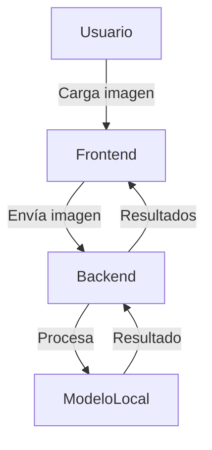

[](LICENSE)

<div align="center">

# PielSana IA


</div>

## Cuidando tu piel con inteligencia artificial

La piel es el órgano más grande de nuestro cuerpo y su salud es fundamental para nuestro bienestar físico y emocional. Sin embargo, muchas personas no tienen acceso fácil a un dermatólogo o a herramientas confiables para evaluar el estado de su piel.
**PielSana IA** nace con la misión de acercar la tecnología de inteligencia artificial a la vida cotidiana, permitiendo que cualquier persona pueda analizar el estado de su piel de manera rápida, privada y sencilla, desde cualquier lugar.

Nuestra plataforma ayuda a detectar y monitorear condiciones cutáneas frecuentes como el acné, la rosácea, las manchas solares y atípicas, la urticaria y las quemaduras. Así, buscamos empoderar a los usuarios para que tomen decisiones informadas sobre su salud y, si es necesario, consulten a un profesional con mayor información.

---

## ¿Cómo funciona PielSana IA?

1. **Sube una foto de tu rostro o zona de interés** a través de una interfaz web simple y segura.
2. **La imagen es analizada por un sistema de inteligencia artificial** que extrae información relevante sobre tu piel usando modelos locales.
3. **Recibes un informe inmediato** sobre posibles condiciones cutáneas detectadas, que puedes usar como referencia para tu autocuidado o para consultar con un especialista.

> **Privacidad:** Tus imágenes se procesan de forma temporal y se eliminan tras el análisis. No almacenamos datos personales.

---

## Estructura del Monorepo

```
Integrador/
├── frontend/               ← React + Vite
│   ├── src/
│   ├── public/
│   ├── package.json
│   ├── vite.config.js
│   └── ...
├── backend/                ← FastAPI y modelos locales
│   ├── main.py
│   ├── requirements.txt
│   ├── config/
│   ├── controllers/
│   ├── models/
│   ├── services/
│   ├── templates/
│   ├── routes.py
│   └── modelos/           ← Aquí van los modelos preentrenados locales
├── README.md
└── .gitignore
```

---

## Casos de Uso

- Autoevaluación y monitoreo de condiciones cutáneas.
- Apoyo para la consulta dermatológica, llevando información objetiva al profesional.
- Seguimiento de la evolución de lesiones o tratamientos.
- Herramienta educativa para conocer más sobre la salud de la piel.

### Principales Condiciones Cutáneas Analizadas

- **Lunares:** Identificación y clasificación de diferentes tipos de lesiones pigmentadas.
- **Acné:** Identificación y clasificación de diferentes tipos de lesiones acneicas.
- **Rosácea:** Detección de enrojecimiento, pápulas y telangiectasias.
- **Manchas solares y lesiones atípicas:** Evaluación de hiperpigmentaciones y lesiones sospechosas.

---

## ¿Quién puede usarlo?

- Personas que desean cuidar su piel y detectar problemas a tiempo.
- Profesionales de la salud que buscan una herramienta de apoyo.
- Investigadores interesados en el análisis automatizado de imágenes dermatológicas.

---

## Tabla de Contenido

- [PielSana IA](#pielsana-ia)
  - [Cuidando tu piel con inteligencia artificial](#cuidando-tu-piel-con-inteligencia-artificial)
  - [¿Cómo funciona PielSana IA?](#cómo-funciona-pielsana-ia)
  - [Estructura del Monorepo](#estructura-del-monorepo)
  - [Casos de Uso](#casos-de-uso)
    - [Principales Condiciones Cutáneas Analizadas](#principales-condiciones-cutáneas-analizadas)
  - [¿Quién puede usarlo?](#quién-puede-usarlo)
  - [Tabla de Contenido](#tabla-de-contenido)
  - [Características Técnicas](#características-técnicas)
  - [Tabla de Tecnologías](#tabla-de-tecnologías)
  - [Diagrama de Arquitectura](#diagrama-de-arquitectura)
  - [Capturas de Pantalla / GIF de Uso](#capturas-de-pantalla--gif-de-uso)
  - [Instalación y Uso](#instalación-y-uso)
    - [Requisitos](#requisitos)
    - [Backend](#backend)
    - [Frontend](#frontend)
  - [Despliegue del Backend con Docker](#despliegue-del-backend-con-docker)
    - [Construir la imagen Docker](#construir-la-imagen-docker)
    - [Ejecutar el contenedor](#ejecutar-el-contenedor)
  - [Nota sobre permisos de Docker en Linux/EC2](#nota-sobre-permisos-de-docker-en-linuxec2)
  - [Exponer el backend con ngrok](#exponer-el-backend-con-ngrok)
    - [Instrucciones para usar ngrok en EC2 (complemento, no reemplaza Docker)](#instrucciones-para-usar-ngrok-en-ec2-complemento-no-reemplaza-docker)
  - [Ejemplo de Request/Response de la API](#ejemplo-de-requestresponse-de-la-api)
  - [FAQ - Preguntas Frecuentes](#faq---preguntas-frecuentes)
  - [Reconocimientos y Créditos](#reconocimientos-y-créditos)
  - [Política de Privacidad](#política-de-privacidad)
  - [Contribución](#contribución)
  - [Licencia y Contacto](#licencia-y-contacto)
  - [Modelos Integrados](#modelos-integrados)
    - [Modelos locales](#modelos-locales)

---

## Características Técnicas

PielSana IA combina lo último en inteligencia artificial y desarrollo web para ofrecer una experiencia robusta y segura:

- **Frontend:** Interfaz web desarrollada en React/Vite, fácil de usar y accesible desde cualquier dispositivo.
- **Backend:** API en FastAPI que gestiona la recepción y análisis de imágenes.
- **Modelos de IA:** Utiliza un modelo local de análisis dermatológico (por ejemplo, entrenado sobre el dataset HAM10000). El sistema está preparado para integrar modelos adicionales en el futuro.
- **Privacidad:** Procesamiento temporal de imágenes, sin almacenamiento de datos personales.
- **Extensibilidad:** Arquitectura modular que permite agregar nuevos modelos y funcionalidades fácilmente.

## Tabla de Tecnologías

| Capa         | Tecnología                                 |
|--------------|--------------------------------------------|
| Frontend     | React, Vite, TypeScript, TailwindCSS       |
| Backend      | FastAPI, Python, TensorFlow, Keras         |
| Modelos      | Modelos locales (ej: lunares.keras, otros) |
| Infraestructura | Docker, .env            |

## Diagrama de Arquitectura



## Capturas de Pantalla / GIF de Uso

<!-- Agrega aquí imágenes o GIFs mostrando el flujo de uso -->
<!--  -->

---

## Instalación y Uso

### Requisitos

- Python 3.10+
- Node.js 18+ (para el frontend)
- Docker (opcional)

### Backend

```bash
cd backend
python3.10 -m venv venv
source venv/bin/activate
pip install --upgrade pip
pip install -r requirements.txt
python main.py
```
La API estará disponible en http://localhost:8080

### Frontend

```bash
cd frontend
npm install
npm run dev
```
La interfaz web estará disponible en http://localhost:5173

---

## Despliegue del Backend con Docker

Puedes correr el backend de FastAPI fácilmente usando Docker. Esto te permite desplegar la API en cualquier entorno compatible con Docker (local, nube, EC2, etc.).

### Construir la imagen Docker

Desde la raíz del proyecto (donde está la carpeta backend/), ejecuta:

```bash
sudo docker build -t pielsana-backend -f backend/Dockerfile .
```

### Ejecutar el contenedor

```bash
sudo docker run -p 8080:8080 pielsana-backend
```

- El backend estará disponible en http://localhost:8080
- Si necesitas montar modelos grandes, asegúrate de que estén presentes en la carpeta backend/modelos/ antes de construir la imagen.

---

## Nota sobre permisos de Docker en Linux/EC2

En algunas distribuciones de Linux (como Ubuntu en EC2), puede que necesites usar `sudo` para ejecutar comandos de Docker si tu usuario no tiene permisos suficientes. Ejemplo:

```bash
sudo docker build -t pielsana-backend -f backend/Dockerfile .
sudo docker run -p 8080:8080 pielsana-backend
```

Si prefieres evitar usar `sudo` cada vez, puedes agregar tu usuario al grupo `docker`:

```bash
sudo usermod -aG docker $USER
```
Luego cierra y vuelve a abrir la sesión para que los cambios tengan efecto.

---


## Exponer el backend con ngrok

### Instrucciones para usar ngrok en EC2 (complemento, no reemplaza Docker)


2. **Instala y ejecuta ngrok en tu instancia EC2**
   ```bash
   wget https://bin.equinox.io/c/bNyj1mQVY4c/ngrok-v3-stable-linux-amd64.tgz
   tar -xvzf ngrok-v3-stable-linux-amd64.tgz
   sudo mv ngrok /usr/local/bin
   ngrok http 8080
   ```
   (Opcional: agrega tu authtoken si tienes cuenta en ngrok)

3. **Copia la URL HTTPS que te da ngrok**
   (por ejemplo, `https://abcd1234.ngrok.io`)

4. **Entra a Vercel y cambia la variable de entorno `VITE_API_URL`**
   Pon la URL de ngrok y vuelve a desplegar el frontend.

5. **¡Listo!**
   Tu frontend en Vercel podrá comunicarse con el backend por HTTPS sin problemas de mixed-content.

> Recuerda: cada vez que reinicies ngrok, la URL cambiará y deberás actualizarla en Vercel.

> **Nota importante:**
> 
> El backend de PielSana IA debe estar siempre corriendo (por ejemplo, usando Docker, como se explica en las secciones anteriores).
> 
> La sección de ngrok es una opción adicional pensada para exponer temporalmente el backend por HTTPS, facilitando la integración con frontends desplegados en plataformas como Vercel (que requieren HTTPS para evitar problemas de mixed-content).
> 
> **ngrok no reemplaza Docker ni la ejecución normal del servidor:** simplemente crea un túnel seguro hacia el backend ya montado en Docker, útil para pruebas, demos o MVP, 


## Ejemplo de Request/Response de la API

**Request:**
```http
POST /skin/api/analyze
Content-Type: multipart/form-data

file: imagen.png
```

**Response:**
```json
{
  "prediccion": "Lúnar Común (Nevus)",
  "probabilidades": {
    "Lúnar Común (Nevus)": 0.85,
    "Melanoma": 0.10,
    "Queratosis Benigna": 0.05
  },
  "modelo": "modelo local"
}
```

---

## FAQ - Preguntas Frecuentes

**¿Se almacenan mis imágenes?**
No, las imágenes se procesan y eliminan tras el análisis.

**¿Puedo usar mis propios modelos?**
Sí, el sistema es modular y permite integrar nuevos modelos fácilmente.

**¿Qué limitaciones tiene el sistema?**
Actualmente, el modelo base solo clasifica imágenes según las condiciones soportadas. El roadmap incluye la integración de más clasificadores específicos.

---

## Reconocimientos y Créditos

- [FastAPI](https://fastapi.tiangolo.com/)
- [React](https://react.dev/)
- [Vite](https://vitejs.dev/)
- [TailwindCSS](https://tailwindcss.com/)
- [TensorFlow](https://www.tensorflow.org/)
- [Keras](https://keras.io/)

---

## Política de Privacidad

Este proyecto procesa imágenes de manera temporal y no almacena datos personales. Si se despliega públicamente, se recomienda agregar una política de privacidad detallada.

---

## Contribución

¿Te gustaría colaborar?
Haz un fork, crea tu rama, realiza tus cambios y abre un Pull Request. ¡Toda ayuda es bienvenida!

---

## Licencia y Contacto

Este proyecto está bajo licencia MIT.
Para consultas o colaboración, contacta a:
- Nombre: [Jorge Espinola]
- Email: [yorluis@hotmail.com]
- GitHub: [github.com/thejoresp]

---

## Modelos Integrados

### Modelos locales
- Puedes integrar cualquier modelo local de análisis dermatológico (por ejemplo, lunares.keras entrenado sobre HAM10000, u otros modelos propios o de terceros).
- El sistema es modular y permite agregar nuevos modelos fácilmente.
- **Próximamente:** Se sumarán modelos específicos para la detección de rosácea y acné, ampliando el alcance de la plataforma.
- **Ejemplo de predicciones del modelo lunares.keras:**
  - Queratosis Actínica
  - Carcinoma Basocelular
  - Queratosis Benigna
  - Dermatofibroma
  - Melanoma
  - Lúnar Común (Nevus)
  - Lesión Vascular

> **Nota importante:**
> 
> El backend de PielSana IA debe estar siempre corriendo (por ejemplo, usando Docker, como se explica en las secciones anteriores).
> 
> La sección de ngrok es una opción adicional pensada para exponer temporalmente el backend por HTTPS, facilitando la integración con frontends desplegados en plataformas como Vercel (que requieren HTTPS para evitar problemas de mixed-content).
> 
> **ngrok no reemplaza Docker ni la ejecución normal del servidor:** simplemente crea un túnel seguro hacia el backend ya montado en Docker, útil para pruebas, demos o MVP, pero no para producción.